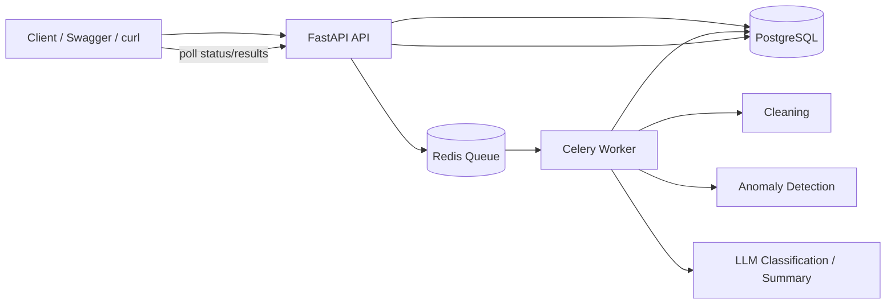
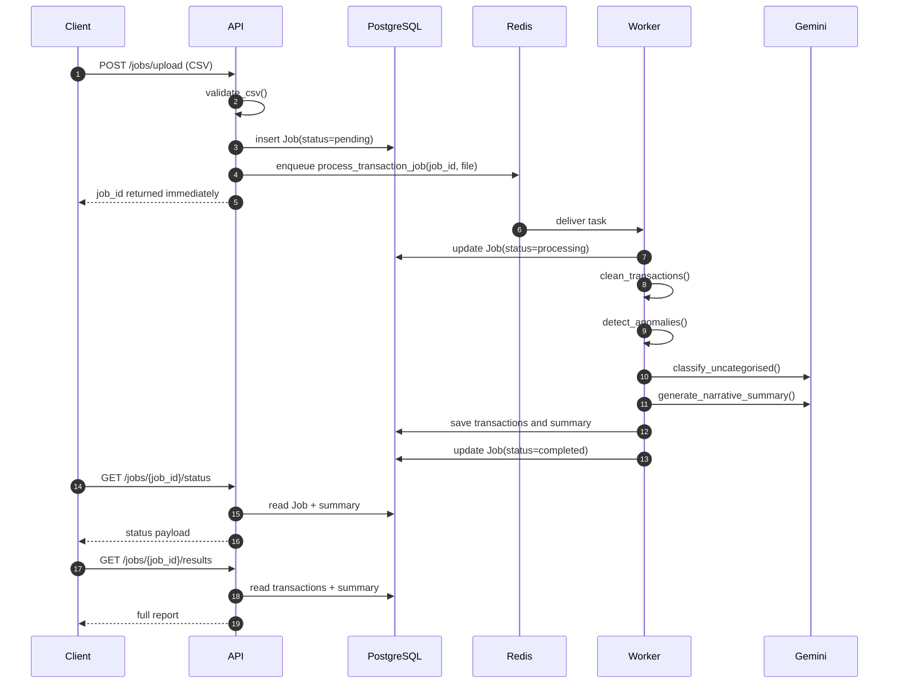
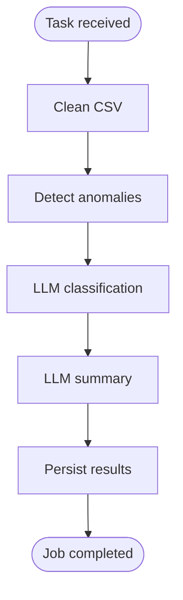
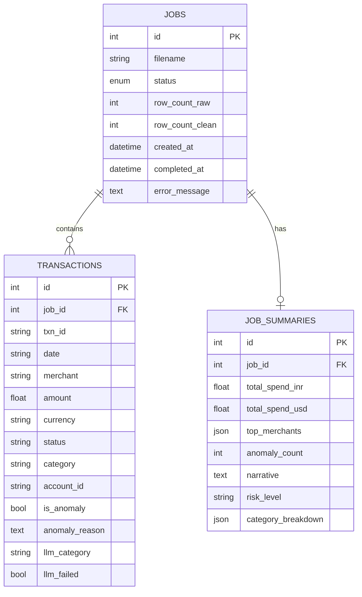
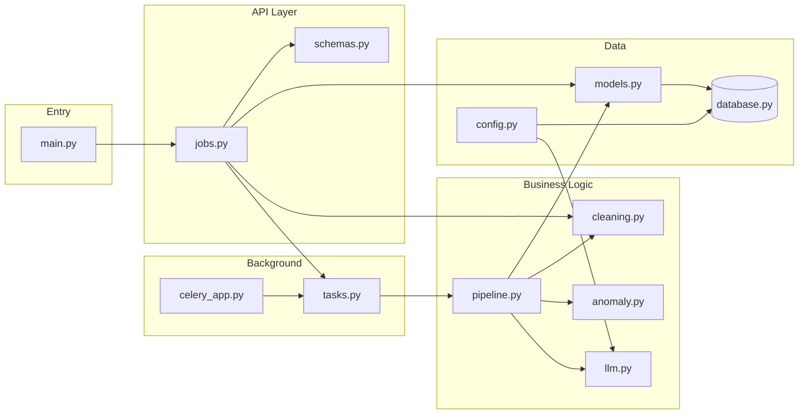
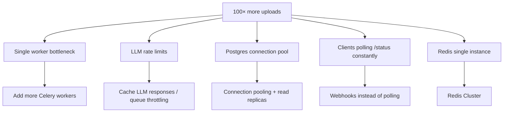

# System Architecture

> One sentence: the client uploads a CSV, the API creates a job and queues work, the worker cleans and enriches the data, PostgreSQL stores the results, and the client polls for completion.
---

## 1. High-Level View


### Component roles
| Component | Responsibility |
|-----------|----------------|
| API | Validates uploads, creates jobs, exposes status/results endpoints |
| Redis | Buffers background tasks |
| Worker | Runs the CSV processing pipeline |
| PostgreSQL | Stores jobs, transactions, and summaries |
| Gemini | Classifies missing categories and generates the narrative summary |
---

## 2. Deployment Topology
The app runs as four Docker containers:

- `api` on port `8000`
- `worker` for Celery jobs
- `db` for PostgreSQL
- `redis` for the task queue
Inside Docker, services talk to each other by container name, not `localhost`.

---

## 3. Request Lifecycle

### Processing order

1. Validate the uploaded CSV.
2. Create the job record in PostgreSQL.
3. Queue the background task in Redis.
4. Clean the data and normalize fields.
5. Detect anomalies.
6. Classify uncategorised rows with the LLM, with fallback if needed.
7. Generate the summary and persist everything.

---

## 4. Worker Pipeline

### What each step does

- `cleaning.py`: validates columns, normalizes dates and amounts, uppercases status/currency, fills missing categories, removes duplicates.
- `anomaly.py`: flags transactions above 3× account median and USD transactions for domestic merchants.
- `llm.py`: batches uncategorised rows for classification and generates the final narrative summary, with retries and fallback rules.
- `pipeline.py`: orchestrates the whole job and writes the final data back to the database.

---

## 5. Database Schema


### Job states

`pending` → `processing` → `completed` or `failed`

---

## 6. Why the Design Works

The API stays thin, the worker does all heavy processing, and PostgreSQL is the single source of truth. That keeps uploads fast, makes the processing pipeline reusable, and lets status/result endpoints read stored data without recomputing anything.

The main trade-off is that the design is optimized for small to medium jobs and clear separation, not for massive concurrent throughput. The next scaling step would be object storage for uploads, bulk writes, more workers, and stronger queue/backpressure controls.

---


If you need a draw.io diagram, recreate this flow:

```text
[Client] -> [FastAPI API] -> [Redis] -> [Celery Worker] -> [PostgreSQL]
                               |            |
                               |            -> [Gemini API]
                               -> status/results read from PostgreSQL
```

Keep the diagram focused on the upload path, background processing, and the status/results polling flow.



| Step | File | Function |
|------|------|----------|
| App starts | `main.py` | Creates tables, mounts routes |
| Upload | `api/jobs.py` | `upload_csv()` |
| Validate | `services/cleaning.py` | `validate_csv()` |
| Enqueue | `worker/tasks.py` | `process_transaction_job.delay()` |
| Process | `services/pipeline.py` | `process_job()` |
| Clean | `services/cleaning.py` | `clean_transactions()` |
| Anomalies | `services/anomaly.py` | `detect_anomalies()` |
| LLM | `services/llm.py` | `classify_uncategorised()`, `generate_narrative_summary()` |
| Status | `api/jobs.py` | `get_job_status()` |
| Results | `api/jobs.py` | `get_job_results()` |
| List | `api/jobs.py` | `list_jobs()` |

---

## 7. API Endpoints Map

```
http://localhost:8000
│
├── GET  /health
│         └── "Is the server alive?"
│
└── /jobs
    ├── POST /upload
    │         └── Input:  CSV file
    │             Output: { job_id, status: pending }
    │
    ├── GET  /{job_id}/status
    │         └── Input:  job_id (number)
    │             Output: status + brief summary when done
    │
    ├── GET  /{job_id}/results
    │         └── Input:  job_id (must be completed)
    │             Output: transactions + anomalies + breakdown + summary
    │
    └── GET  /?status=completed
              └── Input:  optional filter (pending|processing|completed|failed)
                  Output: list of all jobs
```

---

## 8. Async Design — Why Not Process in the API?

```
❌ SYNC (bad for this assignment)
   Upload → wait 6-30 sec → response
   Client timeout, API blocked, can't handle multiple uploads

✅ ASYNC (what we built)
   Upload → job_id in 100ms → client polls
   Worker handles heavy work separately
   Multiple uploads can queue up in Redis
```

| | Sync API | Async (Job + Worker) |
|--|----------|----------------------|
| Response time | 6–30+ seconds | ~100ms |
| LLM failures | Whole request fails | Retry + fallback, job still completes |
| Scale | One request blocks server | Add more workers |
| Pattern | Simple | Industry standard for background jobs |

---


## 10. Folder Structure (Visual Tree)

```
Internship Assignment/
│
├── 🐳 INFRASTRUCTURE
│   ├── docker-compose.yml    ← starts all 4 services
│   ├── Dockerfile            ← builds Python image
│   └── requirements.txt      ← pip packages
│
├── ⚙️ CONFIG
│   ├── .env.example          ← copy to .env for Gemini key
│   └── .gitignore
│
├── 📄 DOCS
│   ├── README.md
│   └── ARCHITECTURE.md       ← this file
│
├── 📊 DATA
│   └── sample_data/transactions.csv
│
└── 🐍 app/
    ├── main.py               ← FastAPI entry
    ├── config.py             ← env settings
    ├── database.py           ← Postgres connection
    ├── models.py             ← DB tables
    ├── schemas.py            ← API response shapes
    │
    ├── api/
    │   └── jobs.py           ← 4 REST endpoints
    │
    ├── services/
    │   ├── pipeline.py       ← orchestrator (calls everything)
    │   ├── cleaning.py       ← step 1
    │   ├── anomaly.py        ← step 2
    │   └── llm.py            ← steps 3 & 4
    │
    └── worker/
        ├── celery_app.py     ← Redis connection
        └── tasks.py          ← background job entry
```

---

## 11. Scale — Where It Breaks at 100× Traffic



| Bottleneck | Fix | Trade-off |
|------------|-----|-----------|
| 1 worker | Scale workers horizontally | More infra cost |
| LLM quota | Rate limit + cache | Stale classifications |
| DB writes | Batch inserts, read replicas | Complexity |
| Polling | SSE / WebSockets / webhooks | Client must support it |
| CSV in Redis | Store in S3, pass URL to worker | Extra service |

---


## Quick Links

| Resource | URL |
|----------|-----|
| API docs (Swagger) | http://localhost:8000/docs |
| Health check | http://localhost:8000/health |
| Gemini API keys | https://aistudio.google.com/apikey |
| draw.io | https://app.diagrams.net |
